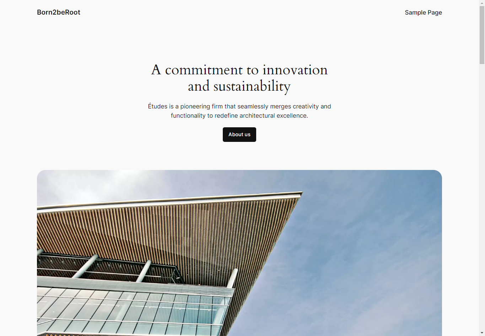

# WordPress Server (LLMP Stack)

We will locally host a WordPress server.



## Install PHP

A scripting language.

```
sudo apt install php php-cgi php-mysql -y
```

Stop Apache2:

```
systemctl status apache2
sudo systemctl stop apache2
sudo systemctl disable apache2
```

## Install Lighttpd

A fast web server software.

```
sudo apt install lighttpd -y
sudo ufw allow 80
sudo ufw allow http

sudo systemctl start lighttpd
sudo systemctl enable lighttpd
sudo systemctl status lighttpd
```

Add port forwarding for 8080 to 80 in VM >> Settings >> Network >> Port Forwarding.

Enable Lighttpd FastCGI module:

```
sudo lighty-enable-mod fastcgi
sudo lighty-enable-mod fastcgi-php
sudo service lighttpd force-reload
```

Test with host browser: http://localhost:8080

### Test Lighttpd with PHP

```
sudo nano /var/www/html/info.php
```

Append these lines to `info.php`:

```
<?php
phpinfo();
?>
```

Check logs:

```
sudo cat /var/log/lighttpd/error.log
sudo journalctl -u lighttpd
```

Test with host browser: http://localhost/info.php

## Install WordPress

A CMS and website builder based on PHP and MySQL.

```
sudo apt install curl wget tar -y
cd /tmp && wget https://wordpress.org/latest.tar.gz
tar -xvf latest.tar.gz
cp -R wordpress /var/www/html/
rm -rf latest.tar.gz wordpress/
```

Change permissions:

```
sudo chown -R www-data:www-data /var/www/html/
sudo chmod -R 755 /var/www/html/
```

## Install MariaDB

An enterprise fork of MySQL.

```
sudo apt install mariadb-server -y
sudo mysql_secure_installation

Switch to unix_socket authentication [Y/n]: N
Change the root password? [Y/n]: N
Remove anonymous users? [Y/n]: Y
Disallow root login remotely? [Y/n]: Y
Remove test database and access to it? [Y/n]:  Y
Reload privilege tables now? [Y/n]:  Y
```

## Create Database

```
sudo mariadb
CREATE DATABASE wp_db;
CREATE USER 'jin-tan'@'localhost' IDENTIFIED BY 'admin123';
GRANT ALL ON wp_db.* TO 'jin-tan'@'localhost';
FLUSH PRIVILEGES;
exit
```

Output database:

```
mariadb -u jin-tan -p
SHOW DATABASES;
```


## Configure WordPress

```
cd /var/www/html
sudo cp wp-config-sample.php wp-config.php
sudo nano wp-config.php
```

Edit following fields based on database.
```
define( 'DB_NAME', 'wp_db' );
define( 'DB_USER', 'jin-tan' );
define( 'DB_PASSWORD', 'admin123' );
```

Go to `http://localhost` and finish setup.

# FTP Server

A protocol to transfer files between computers on a network.

```
sudo apt install ftp vsftpd -y
sudo ufw allow 21
sudo nano /etc/vsftpd.conf
```

Uncomment these lines:

```
anonymous_enable=NO
local_enable=YES
write_enable=YES
ftpd_banner=Welcome to blah FTP service.
```


## Create User

```
sudo systemctl restart vsftpd
sudo adduser ftpuser
sudo mkdir -p /home/ftpuser/ftp/upload
sudo chown -R ftpuser:ftpuser /home/ftpuser/ftp
sudo chmod -R 755 /home/ftpuser/ftp
sudo chmod 750 /home/ftpuser/ftp/upload
```

## Test Connection

```
ftp localhost
quit
echo "Hello World!" > hello.txt
ftp localhost
put hello.txt
ls
```

# Docs

- https://www.digitalocean.com/community/tutorials/install-wordpress-on-ubuntu
- https://www.digitalocean.com/community/tutorials/how-to-install-linux-apache-mariadb-php-lamp-stack-on-debian-10
- https://ubuntu.com/server/docs/how-to-install-and-configure-php
- https://www.digitalocean.com/community/tutorials/how-to-install-wordpress-with-lamp-on-debian-10
- https://www.digitalocean.com/community/tutorials/how-to-protect-ssh-with-fail2ban-on-ubuntu-20-04
