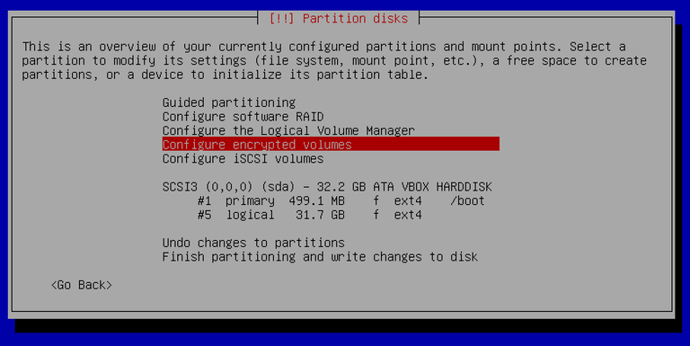
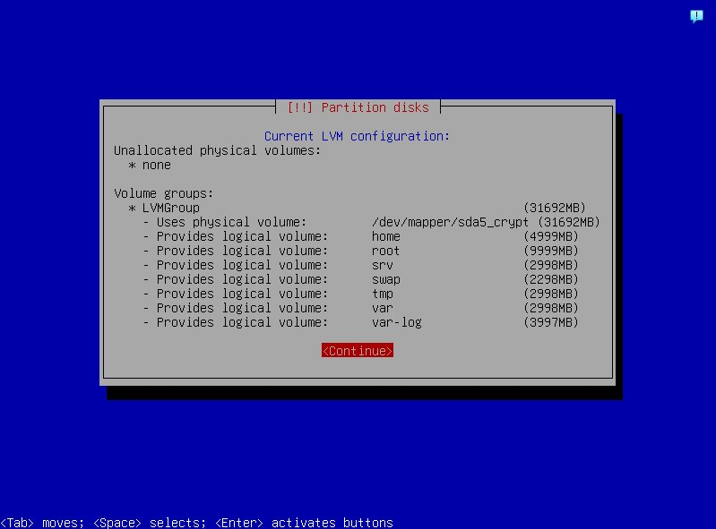
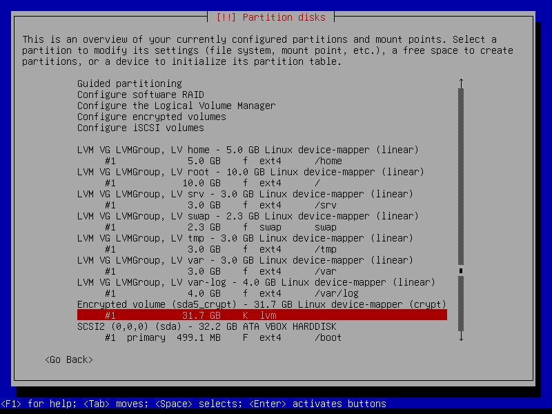
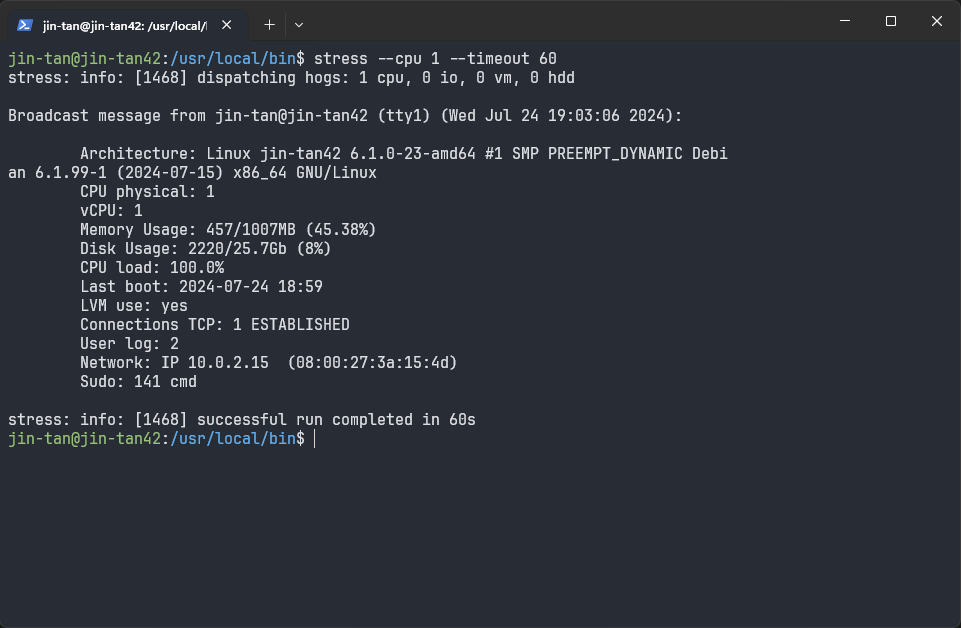
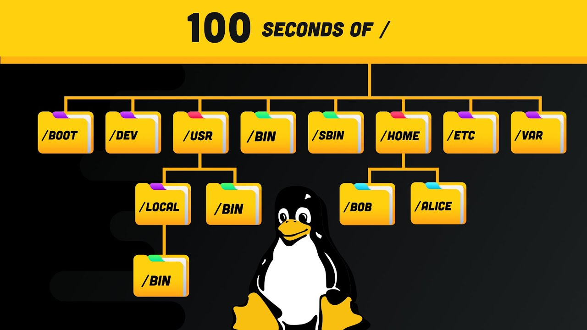
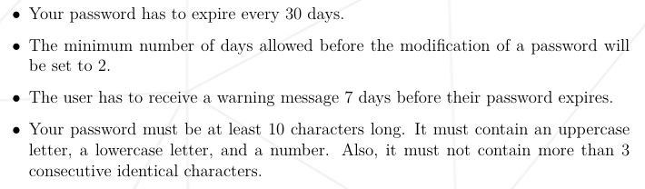
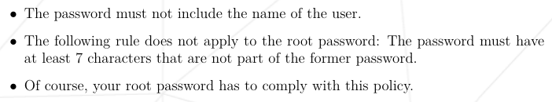

# Born2beRoot Tutorial

## Install VM

Folder should be in sgoinfre.

Set memory to 1024 MB.

Set storage to 12GB, or 30GB for bonus.

## Install Debian

Create partitions:



Configure mounts and sizes:



Configure filesystem:



## Setup VM

### Check Partitions

```
lsblk
```


### Install Sudo

A program that enable users to run programs using superuser (su) privileges.

A user can access sudo when added to sudo group. Each group have its own GID.

```
su
apt install sudo -y
sudo reboot
```

exit or Ctrl+D to exit su.

### Add User & Groups

```
sudo adduser jin-tan
sudo addgroup user42
sudo jin-tan user42
sudo jin-tan sudo
getent group user42
getent group sudo
```


### Configure SSH

A protocol that sets up encrypted connections for remote logins and file transfers between computers.

```
sudo apt install openssh-server -y
sudo nano /etc/ssh/sshd_config
sudo service ssh restart
```

Edit the following lines:

```
Port 4242
PermitRootLogin no
```

For `permitrootlogin`:

| Option              | Description                                    |
|---------------------|------------------------------------------------|
| `prohibit-password` | Allows root login via keys, but not passwords. |
| `no`                | Disables root login entirely.                  |

### Configure UFW

A CLI frontend for configuring iptables.

```
sudo apt install ufw -y
sudo ufw enable
sudo ufw allow ssh
sudo ufw allow 4242
sudo ufw status numbered
```

**Iptables <-> UFW Examples**

Allow Port:

`iptables -A INPUT -p tcp --dport 22 -j ACCEPT`
`sudo ufw allow 4242`

Deny IP:

`iptables -A INPUT -s 192.168.1.100 -j DROP`
`sudo ufw deny from 192.168.1.100`

### Connect to SSH

Add port forwarding for 4242 to 4242 in VM >> Settings >> Network >> Port Forwarding.

From this point onward, we can use SSH to configure the VM from host machine.

```
ssh jin-tan@localhost -p 4242
```

exit or Ctrl+D to disconnect.


### Configure Sudo

Sudoers file handles privilege escalation policies. Use `visudo` for syntax-safe edits to sudoers.

```
sudo visudo
mkdir /var/log/sudo
cd /var/log/sudo
touch sudo.log
```

| Config                           | Description                                             |
|----------------------------------|---------------------------------------------------------|
| `Defaults passwd_tries=3`        | Sets a limit of 3 password attempts before locking out. |
| `Defaults badpass_message=""`    | Customizes the error message for incorrect passwords.   |
| `Defaults logfile="/sudo.log"`   | Specifies the log file location for sudo activities.    |
| `Defaults log_input, log_output` | Logs both input and output of sudo commands.            |
| `Defaults requiretty`            | Requires sudo to be run from a terminal.                |
| `Defaults secure_path=""`        | Excludes specified paths from sudo.                     |

### Configure Password Policies

```
sudo nano /etc/login.defs
sudo apt-get install libpam-pwquality -y
sudo nano /etc/pam.d/common-password
```

Age Policies:

| Policies         | Description                            |
|------------------|----------------------------------------|
| PASS_MAX_DAYS 30 | The max days till password expiration. |
| PASS_MIN_DAYS 2  | The min days till password change.     |
| PASS_WARN_AGE 7  | The days till password warning.        |

Strength Policies:

The `-` sign indicates a minimum requirement.

| Policies         | Description                                                                |
|------------------|----------------------------------------------------------------------------|
| minlen=10        | The minimum characters a password must have.                               |
| ucredit=-1       | Password must have at least 1 capital letter.                              |
| dcredit=-1       | Password must have at least 1 digit.                                       |
| lcredit=-1       | Password must have at least 1 lowercase letter.                            |
| maxrepeat=3      | Password cannot have the same character repeated 3 consecutive times.      |
| reject_username  | Password cannot have the username within itself.                           |
| difok=7          | Password must have at least 7 different characters from the last password. |
| enforce_for_root | Password policy will be enforced for the root user.                        |

### Monitoring Script

This script collects various system information and displays it using the `wall` command.

```
cd /usr/local/bin/
touch monitoring.sh
chmod 777 monitoring.sh
sudo nano monitoring.sh
sh monitoring.sh
```

To stress-test the system for CPU load:

```
sudo apt install stress -y
stress --cpu 1 --timeout 60
```



Details in `MONITORING.md`.

### Crontab

A background process manager for scheduling and automating tasks.

```
sudo crontab -u root -e
*/10 * * * * sh /usr/local/bin/monitoring.sh
sudo crontab -u root -l
```

Check logs:

```
sudo grep 'CRON' /var/log/syslog
journalctl -u cron.service
```

Crontab Format:

```
Min Hour Day_Of_Month Month Day_Of_Week Cmd
```

## Bonus: WordPress + FTP Server

For the bonus tutorial, refer to: [](BONUS.md)

## Signature

Store VM in `~/VirtualBox VMs/`

Obtain signature in SHA-1 checksum format:

`shasum Born2beRoot.vdi`

## Ports and Addresses

A port is a virtual point where network connections start and end.

An address is a unique identifier for devices on a network.


`127.0.0.1` or localhost is a loopback address, used by the computer itself only.

| Port  | Protocol & Purpose                              |
|-------|-------------------------------------------------|
| 20,21 | FTP: Transfers files between client and server. |
| 22    | SSH: Creates secure network connections.        |
| 25    | SMTP: Sends emails.                             |
| 53    | DNS: Converts domain names to IP addresses.     |
| 80    | HTTP: Web communication protocol.               |
| 123   | NTP: Synchronizes computer clocks.              |
| 179   | BGP: Routes data between large networks.        |
| 443   | HTTPS: Secure version of HTTP.                  |
| 500   | ISAKMP: Sets up secure IPsec connections.       |
| 587   | Secure SMTP: Encrypted email transmission.      |
| 3389  | RDP: Remote desktop access.                     |

## UNIX Filesystem



| Name     | Description                                                          |
|----------|----------------------------------------------------------------------|
| `/bin`   | Essential command binaries, contains `ls`, `cp`, `mv`, etc.          |
| `/sbin`  | Essential superuser binaries, contains `mount`, `deluser`, etc.      |
| `/lib`   | Shared libraries and kernel modules.                                 |
| `/usr`   | Secondary hierarchy, contains user programs and data.                |
| `/etc`   | System-wide configuration files.                                     |
| `/home`  | User home directories.                                               |
| `/boot`  | Files used during the boot process.                                  |
| `/dev`   | Device files representing hardware devices.                          |
| `/sys`   | Device files providing a gateway for direct device interactions.     |
| `/opt`   | Optional software packages.                                          |
| `/var`   | Variable files frequently changed, such as logs and temporary files. |
| `/tmp`   | Temporary files, won't be persisted between reboots.                 |
| `/proc`  | Virtual filesystem to keep track of running processes.               |
| `/media` | Mount points for removable media.                                    |
| `/mnt`   | Temporary mount point for filesystems.                               |
| `/srv`   | Contains data from servers.                                          |

`/usr` subdirectories:

| Name             | Description                     |
| ---------------- | --------------------------------|
| `/usr/bin`       | Non-essential command binaries. |
| `/usr/local/bin` | Locally compiled binaries.      |

## Docs

**Theory**

- https://youtu.be/42iQKuQodW4
- https://www.nakivo.com/blog/virtualbox-network-setting-guide/
- https://github.com/edithturn/42-silicon-valley-netwhat
- https://www.youtube.com/watch?v=9J1nJOivdyw
- https://www.freecodecamp.org/news/file-systems-architecture-explained/
- https://forums.debian.net/viewtopic.php?t=11065
- https://www.linuxatemyram.com/
- https://unix.stackexchange.com/questions/33541/free-output-format/33549
- https://www.digitalocean.com/community/tutorials/how-to-edit-the-sudoers-file
- https://www.cloudflare.com/learning/access-management/what-is-ssh/
- https://www.ssh.com/academy/ssh/protocol
- https://www.baeldung.com/cs/127-0-0-1-vs-localhost
- https://www.cloudflare.com/learning/network-layer/what-is-a-computer-port/
- https://www.baeldung.com/linux/dev-sys-class-differences

**Practical**

- https://42-cursus.gitbook.io/guide/rank-01/born2beroot
- https://mathieu-soysal.gitbook.io/born2beroot/
- https://github.com/pasqualerossi/Born2BeRoot-Guide
- https://nordpass.com/blog/how-to-change-password-linux/
- https://www.baeldung.com/linux/cron-logs-check
- https://docs.google.com/document/d/1-BwCO0udUP7MhRh81Y681zz0BalXtKFtte_FHJc6G4s/edit

## Specifications

Hostname, Users, Groups:


Password Policies:




Sudo Policies:


Script:


